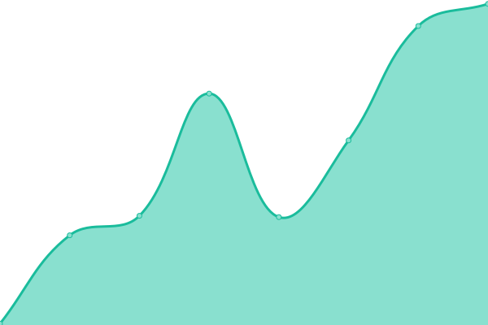

# [📈 Live Status](https://tama774.github.io/sitecheck): <!--live status--> **🟩 All systems operational**

This repository contains the open-source uptime monitor and status page for [tama774](https://tama774.github.io/sitecheck), powered by [Upptime](https://github.com/upptime/upptime).

With [Upptime](https://upptime.js.org), you can get your own unlimited and free uptime monitor and status page, powered entirely by a GitHub repository. We use [Issues](https://github.com/tama774/sitecheck/issues) as incident reports, [Actions](https://github.com/tama774/sitecheck/actions) as uptime monitors, and [Pages](https://tama774.github.io/sitecheck) for the status page.

<!--start: status pages-->
<!-- This summary is generated by Upptime (https://github.com/upptime/upptime) -->
<!-- Do not edit this manually, your changes will be overwritten -->
<!-- prettier-ignore -->
| URL | Status | History | Response Time | Uptime |
| --- | ------ | ------- | ------------- | ------ |
|  [Google](https://www.google.com) | 🟩 Up | [google.yml](https://github.com/tama774/sitecheck/commits/HEAD/history/google.yml) | 

 55ms
     
 | 

<a href="https://tama774.github.io/sitecheck/history/google">100.00%</a>
    

|  [或る阿呆の記](https://hack-le.com) | 🟩 Up | [.yml](https://github.com/tama774/sitecheck/commits/HEAD/history/.yml) | 

 1702ms
     
 | 

<a href="https://tama774.github.io/sitecheck/history/">100.00%</a>
    

|  [QnQ](https://qnqtree.com) | 🟩 Up | [qn-q.yml](https://github.com/tama774/sitecheck/commits/HEAD/history/qn-q.yml) | 

 210ms
     
 | 

<a href="https://tama774.github.io/sitecheck/history/qn-q">100.00%</a>
    

<!--end: status pages-->

[**Visit our status website →**](https://tama774.github.io/sitecheck)

## 📄 License

- Powered by: [Upptime](https://github.com/upptime/upptime)
- Code: [MIT](./LICENSE) © [tama774](https://tama774.github.io/sitecheck)
- Data in the `./history` directory: [Open Database License](https://opendatacommons.org/licenses/odbl/1-0/)
